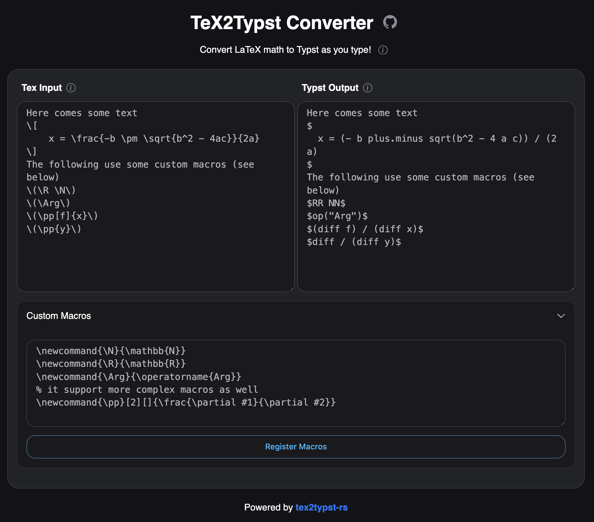

# tex2typst-UI

It converts TeX math to Typst as you type. It uses [tex2typst-rs](https://crates.io/crates/tex2typst-rs) with
WebAssembly under the hood.

See it in action here on GitHub
Pages. [Web Demo](https://unpredictability.github.io/tex2typst-UI/).

# Screenshot

